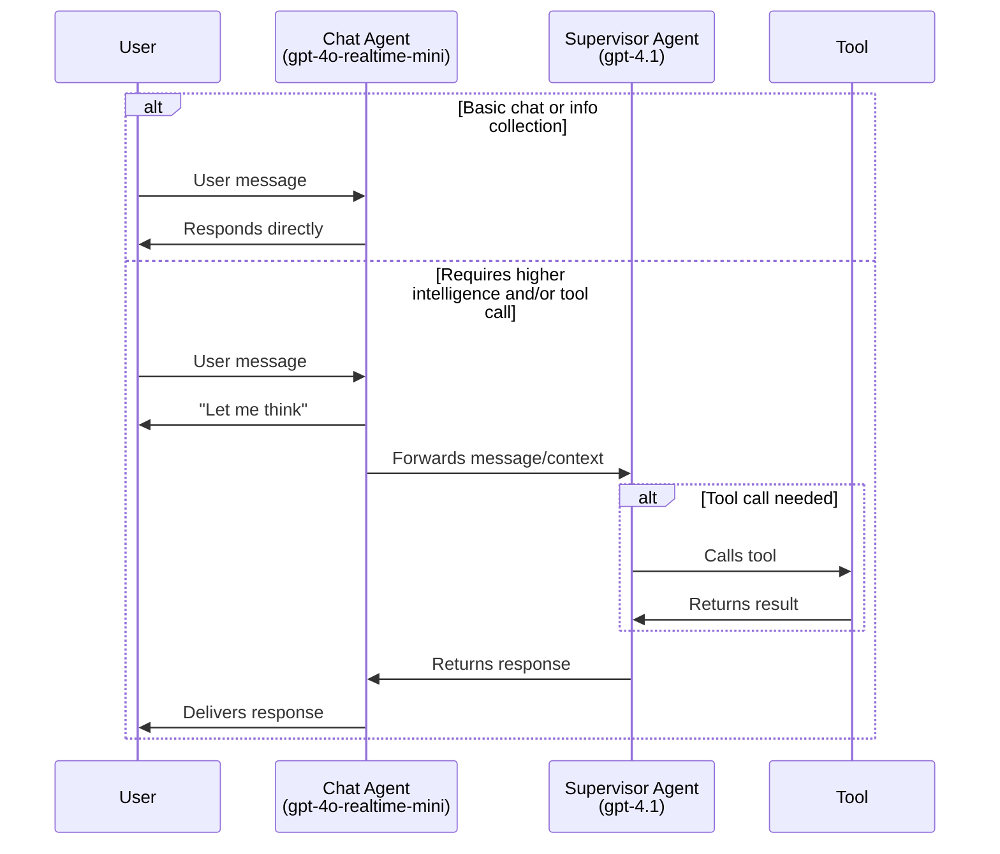
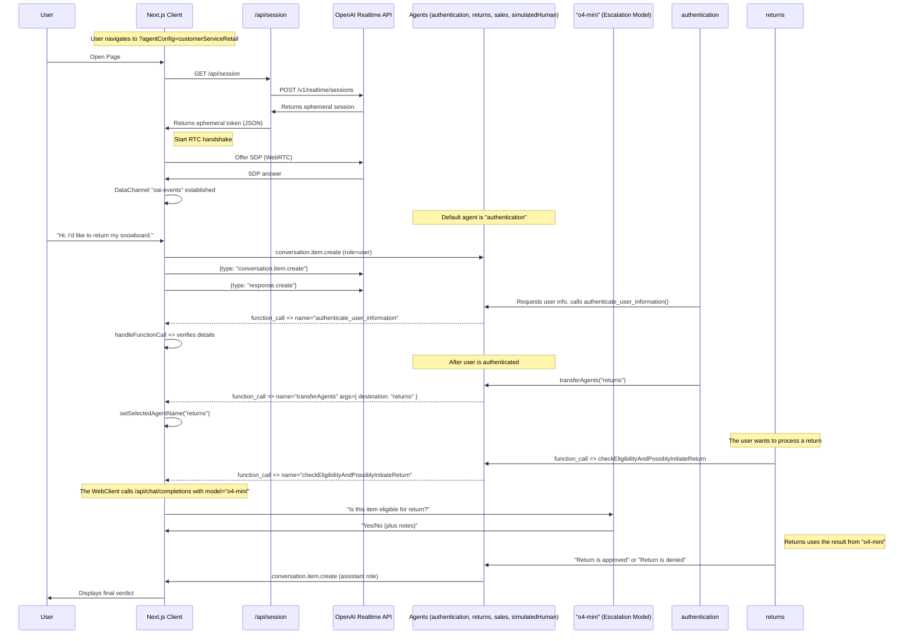

# Realtime API Agents Demo

This is a simple demonstration of more advanced, agentic patterns built on top of the Realtime API. In particular, this demonstrates:
- Sequential agent handoffs according to a defined agent graph (taking inspiration from [OpenAI Swarm](https://github.com/openai/swarm))
- Background escalation to more intelligent models like o4-mini for high-stakes decisions
- Prompting models to follow a state machine, for example to accurately collect things like names and phone numbers with confirmation character by character to authenticate a user.

Here's a quick [demo video](https://x.com/OpenAIDevs/status/1880306081517432936) if you'd like a walkthrough. You should be able to use this repo to prototype your own multi-agent realtime voice app in less than 20 minutes!


## Setup

- This is a Next.js typescript app
- Install dependencies with `npm i`
- Add your `OPENAI_API_KEY` to your env. Either add it to your `.bash_profile` or equivalent file, or copy `.env.sample` to `.env` and add it there.
- Start the server with `npm run dev`
- Open your browser to [http://localhost:3000](http://localhost:3000) to see the app. It should automatically connect to the `simpleExample` Agent Set.

# Agentic Patterns

## 1. Chat-Supervisor Pattern

This is demonstrated in the agentConfig [chatSupervisorDemo](src/app/agentConfigs/chatSupervisorDemo/index.ts). The chat agent uses the realtime model to converse with the user and handle basic tasks, and a more intelligent, text-based supervisor model (e.g. `gpt-4.1`) is used extensively to handle all tool calls and more challenging responses. You can define the decision boundary by "opting in" specific tasks to the chat agent as desired. For the demo, the chat agent handles greeting, chitchat, and collecting necessary information for tool calls.

## Example Flow

*In this screenshot, note the immediate response to collect the phone number, and the deferral to the supervisor agent to handle the tool call and formulate the response. Note that there was only ~2s between the end of "give me a moment to check on that." and the start of the "Thanks for waiting. Your last bill..." message.*

### Flow Schematic


## Benefits
- **Simpler onboarding.** If you already have a performant text-based chat agent, you can give that same prompt and set of tools to the supervisor agent, and make some tweaks to the chat agent prompt, you'll have a natural voice agent that will perform on par with your text agent.
- **Simple ramp to a full realtime agent**: Rather than switching your whole agent to the realtime api, you can move one task at a time, taking time to validate and build trust for each before deploying to production.
- **High intelligence**: You benefit from the high intelligence, excellent tool calling and instruction following of models like `gpt-4.1` in your voice agents.
- **Lower cost**: If your chat agent is only being used for basic tasks, you can use the realtime-mini model, which, even when combined with GPT-4.1, should be cheaper than using the full 4o-realtime model.
- **User experience**: It's a more natural conversational experience than using a stitched model architecture, where response latency is often 1.5s or longer after a user has finished speaking. In this architecture, the model responds to the user right away, even if it has to lean on the supervisor agent.
  - However, more assistant responses will start with "Let me think", rather than responding immediately with the full response.

## Modifying for your own agent
1. Update the `Domain-Specific Agent Instructions` in [supervisorAgent](src/app/agentConfigs/chatSupervisorDemo/supervisorAgent.ts) with your existing own agent prompt and tools. This should contain the "meat" of your voice agent logic and be very speicific with what it should/shouldn't do, and how it should respond.
2. Adapt your prompt to be more appropriate for voice. For example, emphasize the importance of being concise and avoiding bulleted or numbered lists.
3. Add your tool definitions to [chatAgentInstructions](src/app/agentConfigs/chatSupervisorDemo/index.ts). We recommend a brief yaml description to ensure the model doesn't get confused and actually try calling the tool directly.
4. Customize the chatAgent instructions with your own tone, greeting, etc.
5. To minimize costs, try using `gpt-4o-mini-realtime` for the chatAgent and `gpt-4.1-mini` for the supervisor model. To maximize intelligence on particularly difficult or high-stakes tasks, consider trading off latency and adding chain-of-thought to your supervisor prompt, or using a reasoning supervisor model like `o4-mini`.

## 2. Agent Handoffs
Configuration in `src/app/agentConfigs/simpleExample.ts`
```javascript
import { AgentConfig } from "@/app/types";
import { injectTransferTools } from "./utils";

// Define agents
const haikuWriter: AgentConfig = {
  name: "haikuWriter",
  publicDescription: "Agent that writes haikus.", // Context for the agent_transfer tool
  instructions:
    "Ask the user for a topic, then reply with a haiku about that topic.",
  tools: [],
};

const greeter: AgentConfig = {
  name: "greeter",
  publicDescription: "Agent that greets the user.",
  instructions:
    "Please greet the user and ask them if they'd like a Haiku. If yes, transfer them to the 'haiku' agent.",
  tools: [],
  downstreamAgents: [haikuWriter],
};

// add the transfer tool to point to downstreamAgents
const agents = injectTransferTools([greeter, haikuWriter]);

export default agents;
```

This fully specifies the agent set that was used in the interaction shown in the screenshot above.

### Sequence Diagram of CustomerServiceRetail Flow

This diagram illustrates the interaction flow defined in `src/app/agentConfigs/customerServiceRetail/`.

<details>
<summary><strong>Show CustomerServiceRetail Flow Diagram</strong></summary>



</details>

# Next steps
- Check out the configs in `src/app/agentConfigs`. The example above is a minimal demo that illustrates the core concepts.
- [frontDeskAuthentication](src/app/agentConfigs/frontDeskAuthentication) Guides the user through a step-by-step authentication flow, confirming each value character-by-character, authenticates the user with a tool call, and then transfers to another agent. Note that the second agent is intentionally "bored" to show how to prompt for personality and tone.
- [customerServiceRetail](src/app/agentConfigs/customerServiceRetail) Also guides through an authentication flow, reads a long offer from a canned script verbatim, and then walks through a complex return flow which requires looking up orders and policies, gathering user context, and checking with `o4-mini` to ensure the return is eligible. To test this flow, say that you'd like to return your snowboard and go through the necessary prompts!

## Defining your own agents
- You can copy these to make your own multi-agent voice app! Once you make a new agent set config, add it to `src/app/agentConfigs/index.ts` and you should be able to select it in the UI in the "Scenario" dropdown menu.
- To see how to define tools and toolLogic, including a background LLM call, see [src/app/agentConfigs/customerServiceRetail/returns.ts](src/app/agentConfigs/customerServiceRetail/returns.ts)
- To see how to define a detailed personality and tone, and use a prompt state machine to collect user information step by step, see [src/app/agentConfigs/frontDeskAuthentication/authentication.ts](src/app/agentConfigs/frontDeskAuthentication/authentication.ts)
- To see how to wire up Agents into a single Agent Set, see [src/app/agentConfigs/frontDeskAuthentication/index.ts](src/app/agentConfigs/frontDeskAuthentication/index.ts)
- If you want help creating your own prompt using these conventions, we've included a metaprompt [here](src/app/agentConfigs/voiceAgentMetaprompt.txt), or you can use our [Voice Agent Metaprompter GPT](https://chatgpt.com/g/g-678865c9fb5c81918fa28699735dd08e-voice-agent-metaprompt-gpt)

## Customizing Output Guardrails
Assistant messages are checked for safety and compliance using a guardrail function before being finalized in the transcript. This is implemented in [`src/app/hooks/useHandleServerEvent.ts`](src/app/hooks/useHandleServerEvent.ts) as the `processGuardrail` function, which is invoked on each assistant message to run a moderation/classification check. You can review or customize this logic by editing the `processGuardrail` function definition and its invocation inside `useHandleServerEvent`.

## UI
- You can select agent scenarios in the Scenario dropdown, and automatically switch to a specific agent with the Agent dropdown.
- The conversation transcript is on the left, including tool calls, tool call responses, and agent changes. Click to expand non-message elements.
- The event log is on the right, showing both client and server events. Click to see the full payload.
- On the bottom, you can disconnect, toggle between automated voice-activity detection or PTT, turn off audio playback, and toggle logs.

## Core Contributors
- Noah MacCallum - [noahmacca](https://x.com/noahmacca)
- Ilan Bigio - [ibigio](https://github.com/ibigio)
